# User guide

This guide walks through the application in the order you would normally meet it: signing in, reading the dashboard, recording expenses, then setting up the features that save time later. The screenshots come from a running copy with demonstration data loaded.

1. **Opening the application and signing in**

Open a browser and go to the address where the application is hosted (locally, `http://localhost/Expense-Tracker-System/`). When you first arrive you are shown the login page, where you can either sign in or register:
- Log in: if you already have an account, enter your email and password.
- Register: if you do not have an account, choose "Sign up" and provide your full name, mobile number, email, and a password.

Once you are signed in you are taken to the dashboard, which is the home screen of the application.

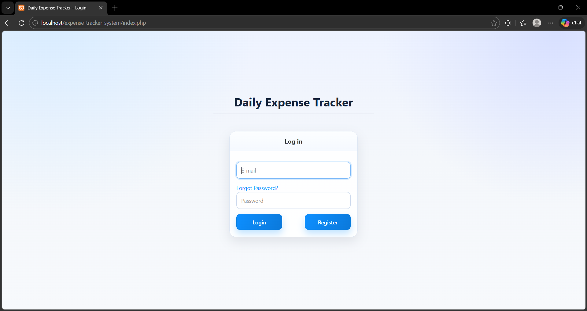

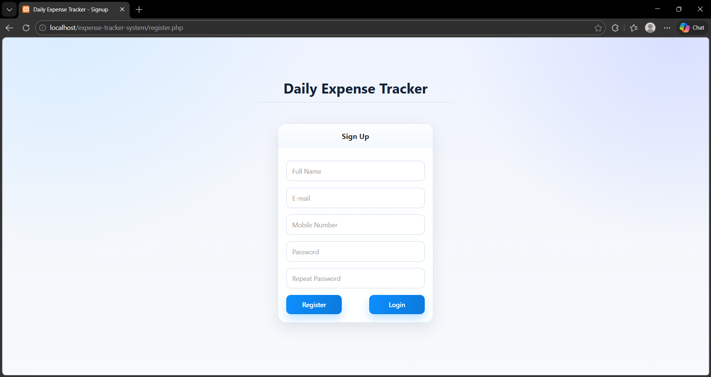

2. **Reading the dashboard**

The dashboard is the overview of your spending. It shows summary figures for recent and total spending, along with charts, including how your money is split across categories. It is meant to answer "am I fine this month?" in a couple of seconds, before you go looking at individual records.

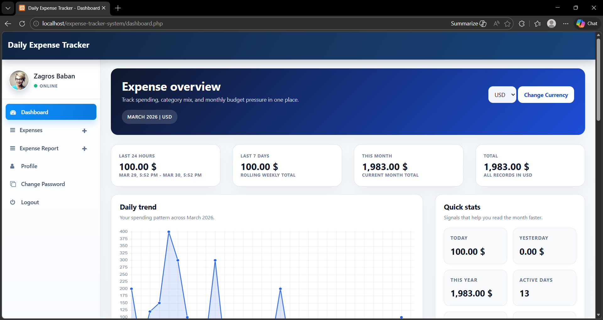

3. **Adding an expense**

Open the "Add expense" page and fill in the form:
- Date: when the money was spent;
- Item: a short description, for example "Groceries";
- Amount and currency: how much, and in which currency;
- Category: the group it belongs to, such as Food or Transport;
- Notes: any optional detail you want to keep;
- Receipt: optionally attach a file. JPG, JPEG, PNG, and PDF are accepted, and anything else is rejected with a message.

Submit the form to save the expense. It appears immediately in your expense list and in the dashboard totals.

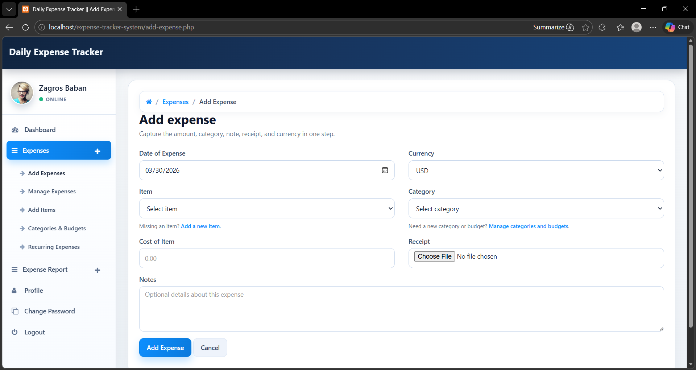

4. **Managing your expenses**

Open the "Manage expenses" page to see your records. From here you can:
- Filter the list by free text, date range, amount range, category, or currency to focus on a subset;
- Edit an expense to correct any field;
- Delete an expense you no longer need (its receipt is removed with it);
- Export the filtered list to a CSV file for use in a spreadsheet.

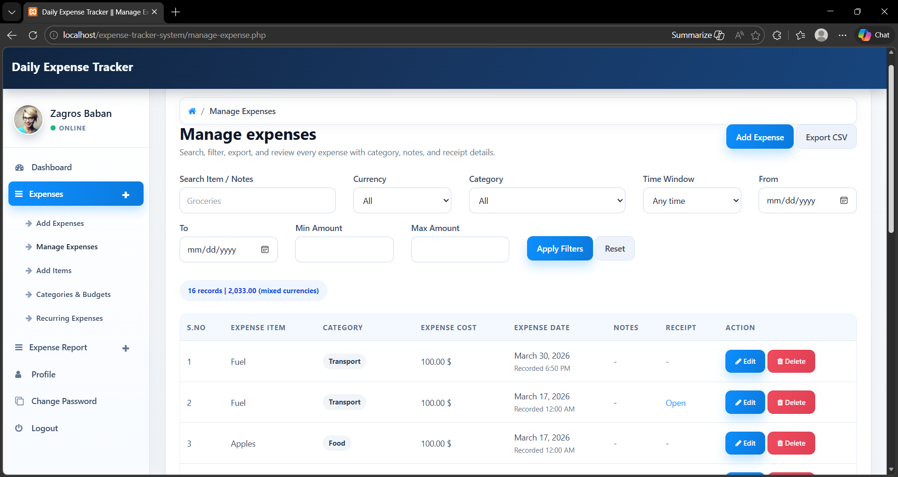

5. **Setting up categories and budgets**

Open the "Categories and budgets" page to organise your spending. You can create new categories, and you can give a category a monthly budget in a chosen currency. As you record expenses, the page and the dashboard show how much of each budget you have used, so you can see when you are approaching or exceeding a limit.

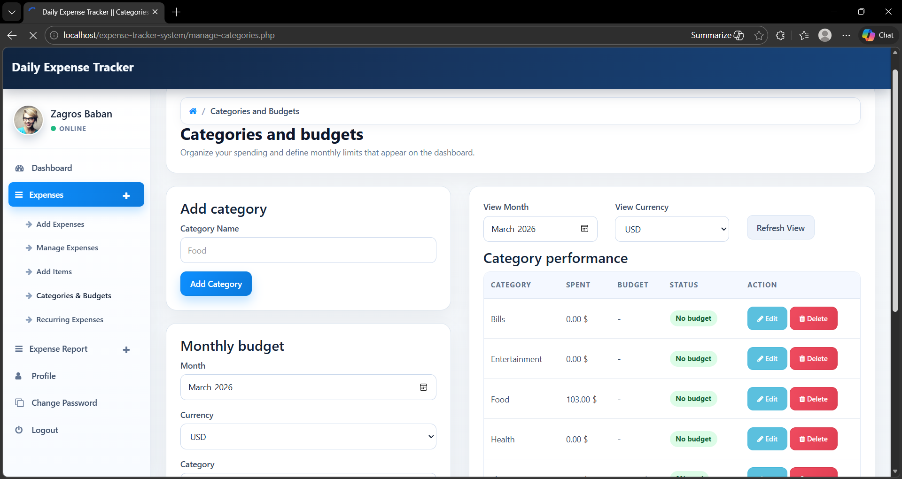

6. **Scheduling recurring expenses**

For payments that repeat, open the "Recurring expenses" page and define a rule with an item, amount, currency, category, frequency (weekly or monthly), and a start date. After that the application creates each expense for you as it falls due, so a monthly bill is never missed just because you forgot to type it in. If you stop paying something, deactivate the rule and nothing further is generated from it.

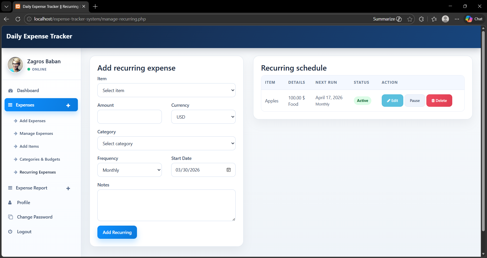

7. **Generating reports**

Open one of the report pages (date-wise, month-wise, or year-wise) and choose a period and currency. The report shows summary cards (including an average per period), a detailed table, and a breakdown of spending by category with a chart. You can export the report to CSV or print it directly from the page.

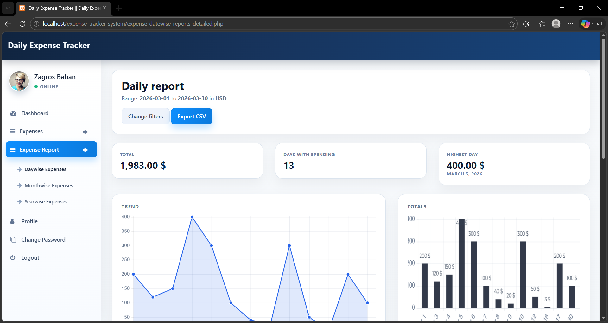

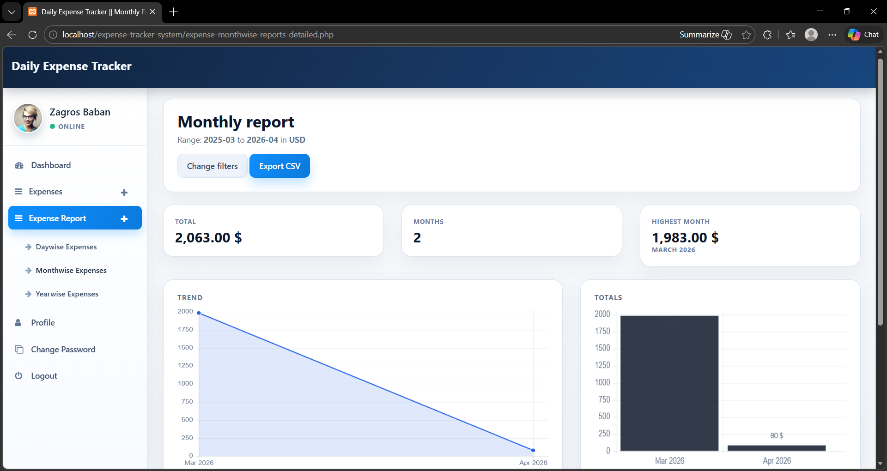

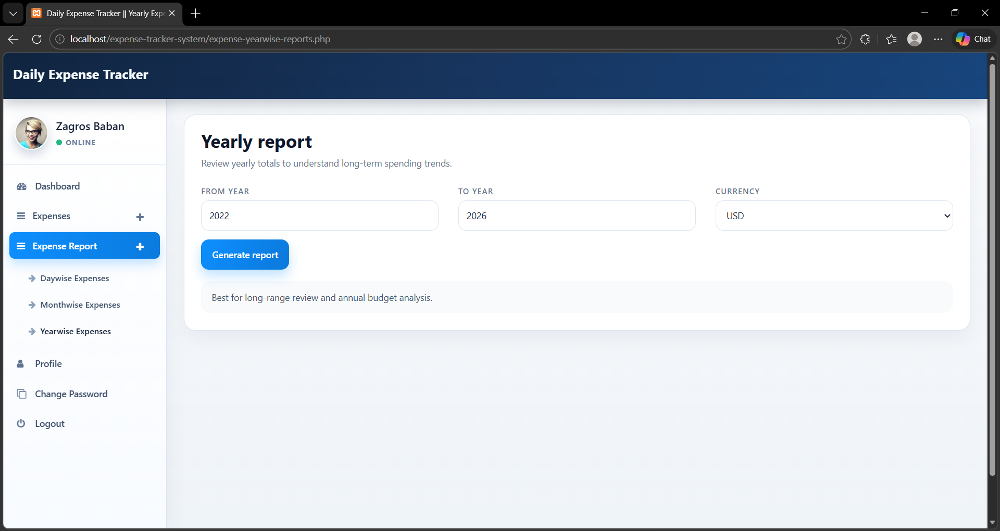

8. **Adjusting your profile and signing out**

Open the profile page to update your details and to set a default currency and default category, which pre-fill the expense form to save time. When you are finished, use "Log out" to end your session; you will be returned to the login page.

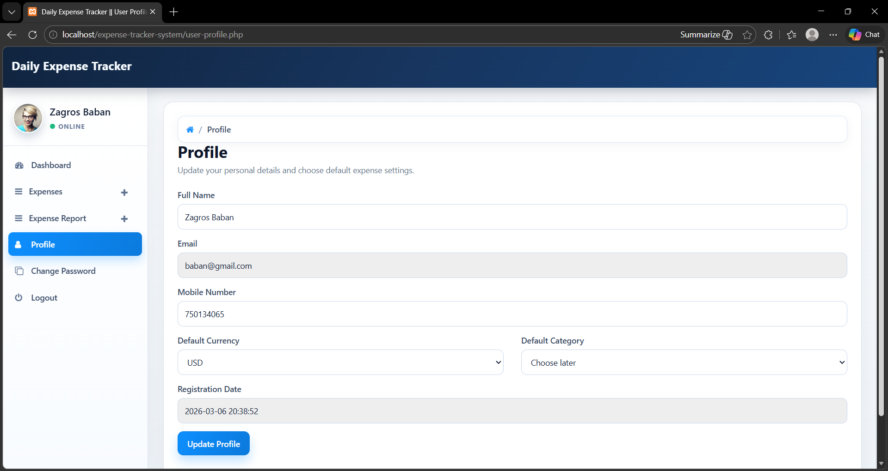
